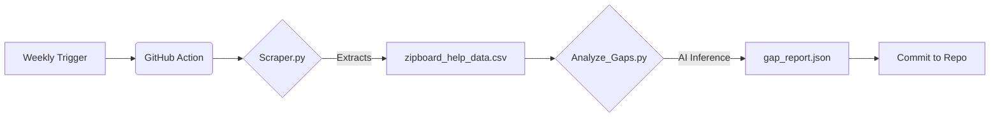

# zipBoard Documentation Audit & Gap Detection Pipeline


An automated ETL pipeline that monitors the [zipBoard Help Center](https://help.zipboard.co), catalogs articles, and uses Large Language Models (LLMs) to identify documentation gaps against industry competitors.

## 🚀 Project Overview

This tool was built to solve the "Stale Documentation" problem in fast-moving SaaS environments. Instead of manual audits, this pipeline:
1.  **Scrapes** the latest help articles using a schema-validated Python scraper.
2.  **Analyzes** the content coverage using **DeepSeek V3 / NVIDIA Nemotron** (via OpenRouter) to find missing topics (e.g., CI/CD, SSO).
3.  **Automates** the entire process via **GitHub Actions** to run on a weekly schedule.

## 🛠️ Architecture



## 📂 Project Structure

```bash
.
├── .github/workflows/
│   └── doc_audit.yml      # CI/CD Workflow definition
├── analyze_gaps.py        # AI Analysis Logic (OpenRouter Integration)
├── scraper.py             # BeautifulSoup Scraper for Help Scout sites
├── requirements.txt       # Python dependencies
├── zipboard_help_data.csv # The "Database" (Snapshot of help center)
└── gap_report.json        # The final output (Identified gaps)

```

## ⚡ Setup & Usage

### 1. Local Installation

```bash
# Clone the repository
git clone https://github.com/ayushsgit/zipboard-documentation-audit.git
cd zipboard-documentation-audit

# Install dependencies
pip install -r requirements.txt

```

### 2. Configuration

You need an API Key for OpenRouter (or OpenAI/Gemini) to run the analysis script.

```bash
export OPENROUTER_API_KEY="sk-or-v1-..."

```

### 3. Running the Pipeline

**Step 1: Scrape Data**
Fetches all 300+ articles and saves them to CSV.

```bash
python scraper.py

```

**Step 2: Run AI Analysis**
Reads the CSV and identifies gaps based on competitor benchmarks.

```bash
python analyze_gaps.py

```

## 🤖 How the Automation Works

The `doc_audit.yml` workflow is scheduled to run **every Monday at 09:00 UTC**.

1. It spins up an Ubuntu container.
2. Installs dependencies and runs the scraper.
3. Compares the new data against the AI model.
4. If new gaps are found, it commits the updated `gap_report.json` back to the repository automatically.

## 📊 Key Insights (Sample)

*See `gap_report.json` for full details.*

* **Critical Gap:** Missing native CI/CD integration guides (GitHub Actions/GitLab).
* **Security Gap:** No documentation on Enterprise SSO/SAML configuration.
* **Tools:** Current docs lack "Generic Webhooks" for custom automation.

## 🧠 AI Prompt Engineering strategy

To ensure the AI analysis is deterministic and grounded in the provided data, I utilized a **Role-Based** prompting strategy with strict JSON output constraints.

### System Prompt Template used in `analyze_gaps.py`:

```text
You are a Senior QA Automation Engineer for zipBoard (a bug tracking & visual review tool).

Here is our COMPLETE list of help articles:
{titles}

COMPETITOR INTELLIGENCE:
Competitors like BugHerd and Marker.io excel in these areas:
1. CI/CD Integrations (GitHub Actions, GitLab CI)
2. Accessibility (WCAG) Audits
3. AdBlocker/Extension Troubleshooting
4. Enterprise Security (SSO, Whitelisting)
5. Webhooks & API Automation

TASK:
Identify 5 specific documentation gaps where zipBoard is missing content compared to these standards.

RETURN JSON ONLY. No explanation.
```

## 📝 License

MIT License.
